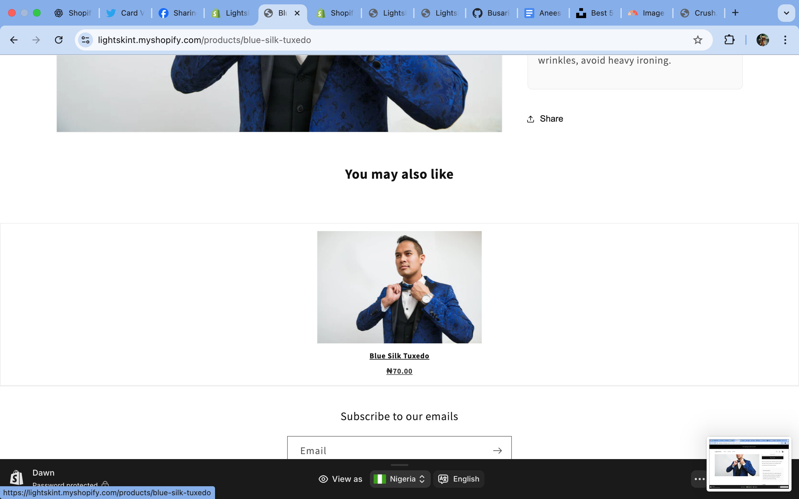

# LIGHTSKINT STORE SHOPIFY THEME ENHANCEMENTS

This project documents the customizations, performance improvements, and third-party integrations implemented for Lightskint Store, a Shopify store selling fashion clothes, shoes, and bags.

The goal of this work was to improve customer experience, optimize SEO, enhance performance, and enable data-driven insights.

# FEATURES IMPLEMENTED

# FRONTEND ENHANCEMENTS

Custom USP Section – Editable section highlighting store benefits (Free Shipping, Easy Returns, Secure Checkout).

Product Recommendations Fallback – Displays related products or fallback to first 4 products if no Shopify AI recommendations are available.

Persistent Cart (localStorage) – Saves guest cart contents across reloads for better UX.

Judge.me Reviews – Integrated review collection and display on product pages (below product price).

Klaviyo Popup Signup Form – Collects emails and builds marketing lists.

Meta Tags & Open Graph – Added dynamic meta tags for SEO and social link previews.

JSON-LD Schema – Ensures rich snippets for products (price, stock, reviews) in search results.

# ANALYTICS & TRACKING

Google Analytics 4 – GA4 Measurement ID installed in theme.

Custom GA4 Event: free_shipping_goal_reached triggers when cart subtotal passes $100.

# ⚡ PERFORMANCE OPTIMIZATIONS

Lighthouse Audit fixes:

Compressed images with Crush.pics (external app).

Added loading="lazy" to product images.

Minified CSS/JS (base.min.css, theme.min.js).

Screenshots

## Screenshots  

### Homepage  
  

### USP Section  
  

### Cart Drawer with Free Shipping Goal Tracking  
  

### Judge.me Reviews Integration  
  

### Klaviyo Signup Popup  
  

### Lighthouse Performance Audit  
  

Custom USP Section

Cart Drawer with GA4 Event Trigger

Judge.me Reviews under Product Price

# 🛠️ INSTALLATION

Clone or download the theme:

git clone https://github.com/yourusername/lightskint-shopify-theme.git
cd lightskint-shopify-theme

Upload theme to Shopify via Theme Kit, Shopify CLI, or manually.

Enable Features:

USP Section → sections/usp-icons.liquid

Persistent Cart → assets/cart-drawer.js

GA4 Measurement ID → Paste in theme.liquid <head>

Judge.me → Install app → paste snippet in product-template.liquid after product price.

Klaviyo → Install app → enable popup/signup form.

SEO Setup:

Update Homepage Title & Description in Shopify Admin → Preferences.

Verify Open Graph & Twitter Cards with Facebook Debugger/Twitter Validator.
